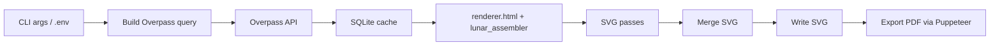

# osm2vector


Offline OpenStreetMap renderer for large areas with vector export (`SVG` + `PDF`), local style overrides, and SQLite caching for Overpass queries.

## Highlights

- Fully offline rendering flow after data fetch (no online tile renderer).
- Large-area export pipeline optimized for print/design.
- Style system with `styles/default.js` + optional `styles/<name>.js`.
- Three-pass render composition: areas -> buildings -> lines.
- Local Overpass cache (`better-sqlite3`) with configurable TTL.

## Quick Start

```bash
npm i
cp .env.example .env
npm run setup
npm run render:test
```

PowerShell:

```powershell
npm i
Copy-Item .env.example .env
npm run setup
npm run render:test
```

`npm run setup` checks browser availability (Chrome/Edge or Puppeteer-installed Chrome) and runs a smoke render.

## How It Works



## Usage

### Base Commands

```bash
npm run render
npm run render:test
```

Equivalent explicit mode:

```bash
npm run render -- --mode full
npm run render -- --mode test
```

### Common Overrides

```bash
# custom output basename
npm run render -- --output outputs/nn_custom

# custom bbox (south,west,north,east)
npm run render -- --bbox 56.1197,43.65,56.4803,44.30

# custom city token and style
npm run render -- --name nn --style default

# bypass cache
npm run render -- --refresh
npm run render -- -r
```

### Output Naming

By default:

- Full mode: `outputs/<city>_<style>_<DDMMYYYY>.svg/.pdf`
- Test mode: `outputs/<city>_<style>_test_<DDMMYYYY>.svg/.pdf`

`city` comes from `CITY_NAME` (default `city`) or from `--name`.

## CLI Options

| Option | Meaning |
| --- | --- |
| `test` | Shortcut for test mode (`node index.js test`) |
| `--mode test|full` | Explicit render mode |
| `--bbox s,w,n,e` | Override bbox for current run |
| `--output <path/base>` | Override output basename (without extension) |
| `--style <name>` | Select style (`styles/<name>.js`) |
| `--name <token>` | City token for default filename |
| `--refresh`, `refresh`, `-r` | Skip cache and force Overpass refresh |

## Environment Variables

| Variable | Default | Description |
| --- | --- | --- |
| `FULL_BBOX_SOUTH/WEST/NORTH/EAST` | `56.1197,43.65,56.4803,44.30` | Full render bbox |
| `TEST_BBOX_SOUTH/WEST/NORTH/EAST` | `56.3134,43.965,56.3466,44.025` | Test render bbox |
| `CITY_NAME` | `city` | Filename city token |
| `OVERPASS_CACHE_DB_PATH` | `db/overpass_cache.sqlite` | Cache DB path |
| `OVERPASS_CACHE_TTL_TEST_HOURS` | `24` | Cache TTL in test mode |
| `OVERPASS_CACHE_TTL_FULL_HOURS` | `168` | Cache TTL in full mode |
| `OVERPASS_URLS` | built-in list | Comma-separated Overpass endpoints |
| `PUPPETEER_EXECUTABLE_PATH` | auto-detect | Browser executable override |
| `RENDER_CANVAS_SIZE` | `2000` | Render canvas size (min effective `1000`) |
| `RENDER_ATTEMPTS` | `3` | Retry count for renderer target failures |

## Style System

- Base style: `styles/default.js`
- Optional overrides: `styles/<name>.js`
- If the selected style file is missing, renderer falls back to `default`.
- Feature-specific coloring/strokes are computed in browser runtime via `createMapStyle(...)`.

Current default style supports dedicated colors for:

- background, water, parks, sidewalk/plaza areas
- buildings, roads, railways, tram overlays, sidewalks, stairs

## Project Structure

```text
.
|- index.js                  # CLI + fetch + cache + render + export orchestration
|- renderer.html             # browser runtime wrapper for lunar_assembler
|- styles/default.js         # default map style
|- scripts/setup.js          # one-command environment/setup check
|- lunar_assembler.js        # vendored renderer bundle
|- lunar_assembler.dist.css  # vendored renderer styles
|- db/                       # sqlite cache location
|- outputs/                  # default render output folder
```

## Testing

- `npm test` is currently a placeholder (`No unit tests configured`).
- Practical smoke test: `npm run render:test`.

## Third-Party

- [lunar_assembler](https://github.com/matkoniecz/lunar_assembler)
- [OpenStreetMap](https://www.openstreetmap.org/)
- [Overpass API](https://wiki.openstreetmap.org/wiki/Overpass_API)
- [Puppeteer](https://pptr.dev/)
- [Axios](https://github.com/axios/axios)
- [better-sqlite3](https://github.com/WiseLibs/better-sqlite3)
- [dotenv](https://github.com/motdotla/dotenv)

## License

Licensed under `AGPL-3.0-only` (see `LICENSE`).

Includes vendored code from [matkoniecz/lunar_assembler](https://github.com/matkoniecz/lunar_assembler), also under `AGPL-3.0-only`.
